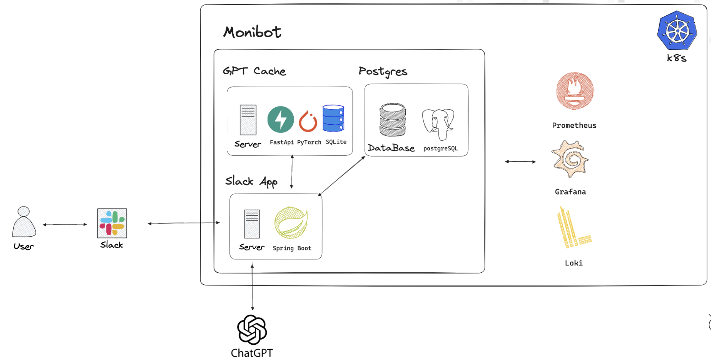
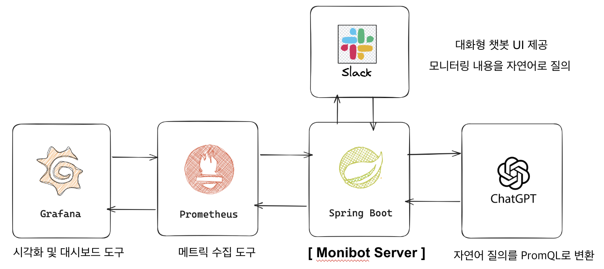
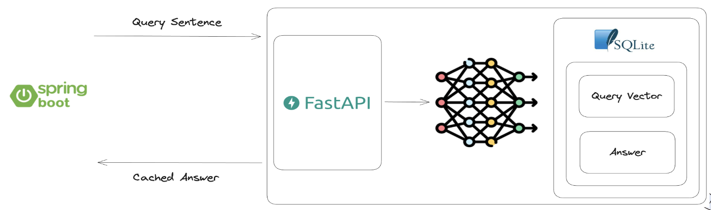
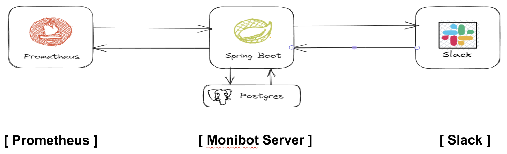
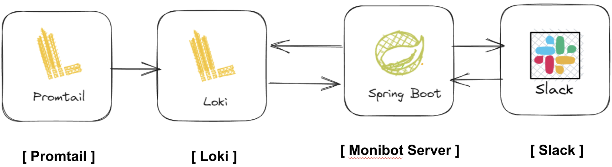
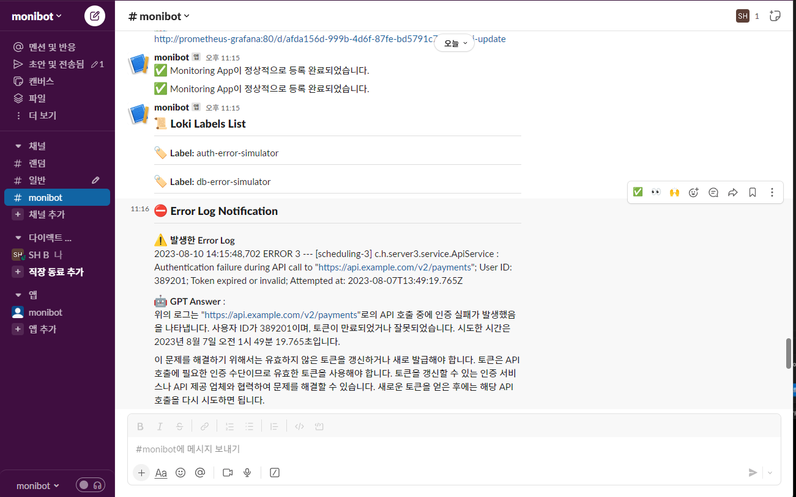

# Monibot
오픈 인프라 개발 경진대회 (OIDC 2023) Chat GPT를 활용한 Monitoring ChatBot

## 개발 동기

```
클라우드 컴퓨팅은 현대 비즈니스와 기술 환경에서 중요한 역할을 하고 있습니다. 그러나 복잡한 클라우드 인프라의 관리와 모니터링은 도전적인 과제로 부각되고 있습니다. 이로 인해 운영자들은 실시간 데이터 및 이상 징후에 대한 빠른 대응이 필요하며, 이를 지원할 효과적인 방법이 필요합니다.

이러한 문제를 해결하기 위해 우리는 클라우드 모니터링 챗봇을 개발하기로 결정했습니다. 이 챗봇은 실시간 데이터 수집 및 분석을 통해 클라우드 시스템의 상태를 모니터링하고, 사용자들에게 쉽고 빠르게 정보를 제공하는 역할을 수행합니다. 이를 통해 클라우드 운영의 효율성을 증가시키고 문제 발생 시 대응 속도를 향상시킬 수 있습니다.

또한, 사용자들이 기존의 복잡한 모니터링 도구를 사용하지 않고도 직관적이고 자연스러운 대화를 통해 클라우드 시스템 상태에 대한 정보를 얻을 수 있도록 함으로써, 비전문가들도 쉽게 활용할 수 있는 환경을 조성하고자 합니다.

```

## 개발 목표

```
1. 실시간 모니터링
	: Prometheus와 Grafana는 클라우드 시스템의 실시간 데이터 수집 및 시각화를 지원하여 
	  실시간 모니터링을 가능하게 합니다. 이를 통해 시스템의 상태 변화를 실시간으로 파악하고 문제를 
	  빠르게 감지할 수 있습니다.
    
2. 자연스러운 인터페이스
	: Slack 챗봇을 활용하여 사용자들이 자연스럽게 클라우드 시스템 상태에 관한 정보를 얻을 수 있도록 합니다. 
	  대화 형식의 인터페이스를 통해 사용자들은 복잡한 명령어나 쿼리 없이도 쉽게 원하는 정보를 얻을 수 있습니다.
    
3. 향상된 대응 능력 
	: 챗봇은 Prometheus와 Grafana에서 수집한 데이터를 분석하여 이상 징후를 탐지하고, 사용자에게 
	  실시간으로 알림을 제공할 수 있습니다. 이를 통해 문제 발생 시 신속한 대응이 가능하며, 장애 발생을 
	  최소화할 수 있습니다.
    
4. 비전문가 사용자 지원
	: 챗봇은 비전문가들도 쉽게 활용할 수 있는 환경을 제공합니다. 복잡한 명령어나 쿼리 대신 간단한 대화를 통해
	  정보를 얻을 수 있어, 모니터링에 대한 접근성을 높이고 사용자 경험을 개선합니다.
```


## 주요기능

```

1. 모니터링 (“/monitor”)
- 챗봇을 활용한 모니터링 쿼리 실행 및 시각화 작업 자동화
- 자연어 입력으로 모니터링 쿼리 생성
- PromQL 쿼리 생성 및 실행
- Grafana 대시보드 생성 및 URL 반환

2. GPT Cache
- 유사한 내용을 질문하는 경우 캐싱되어 있던 promql query를 사용하도록 하여 비용 절감
- 실제 의미에 대한 유사도를 파악하기 위해 딥러닝 모델을 사용

3. Alert Metric (“/alert-metric”)
- 지정한 메트릭이 설정된 임계값 이상 혹은 이하일 경우 알람 발생
- 일시적인 스파이크나 짧은 기간의 이상 현상으로 인한 불필요한 알람 방지 기능 탑재

4. Alert Loki 기능  (“/alert-loki”)
- 파드에서 발생하는 에러 로그를 분석하여 상태 진단 수행 
- LogQL에 대한 응답 중 Error Log가 있으면, Chatgpt API를 이용하여 해결 방안을 얻은 후 Slack 전송


```

## 구조


### 모니터링


### GPT Cache


### Alert Metric


### Alert Loki


## 사용자 UI


## 테스트하기

```bash

# git clone 받기

git clone https://github.com/OIDC2023-SilverLining/monibot.git

# monibot 폴더로 이동

cd monibot

# 차트 설치

helm install monibot ./monibot

# 설치 성공 여부 확인

helm list
kubectl get pods

```

## 활용 기술

- Language - java, python
- slackAppServer: Spring Boot, Slack API, Prometheus API, Grafana Dashboard API
- gptCache: Python FastAPI, SQLite VSS(Vector Similarity Search)
- Database - Postgres, sqllite3

## etc
- [DEMO VIDEO URL](https://drive.google.com/file/d/1GTDzRXXI5YavTSLDWHPtPMT03reMGFq0/view?usp=sharing)
- Slack App과 서버 연결 가이드 [WIKI](https://github.com/OIDC2023-SilverLining/monibot/wiki/Slack-App%EA%B3%BC-Server-%EC%97%B0%EA%B2%B0-Guide)
- 다른 세부사항은 `WIKI` 및 `Projects` 패널 참조 : [WIKI](https://github.com/open-tube/open-tube/wiki)
